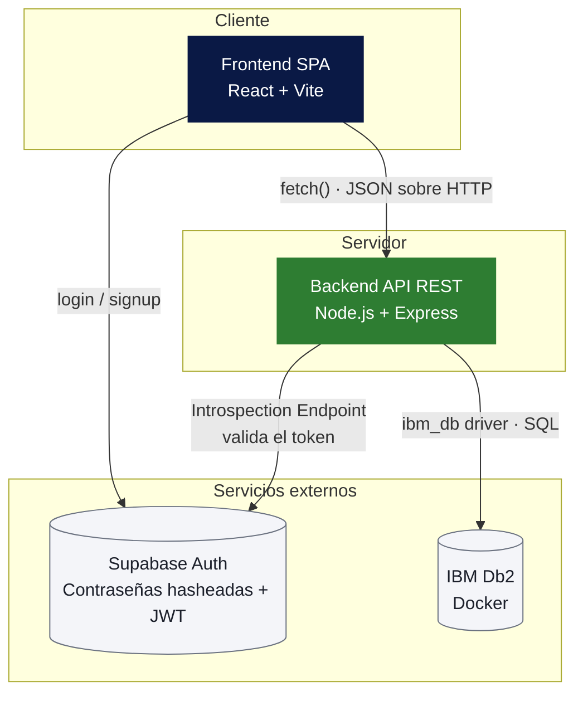
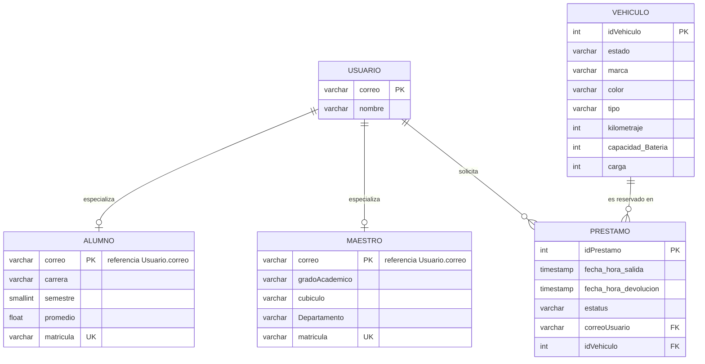
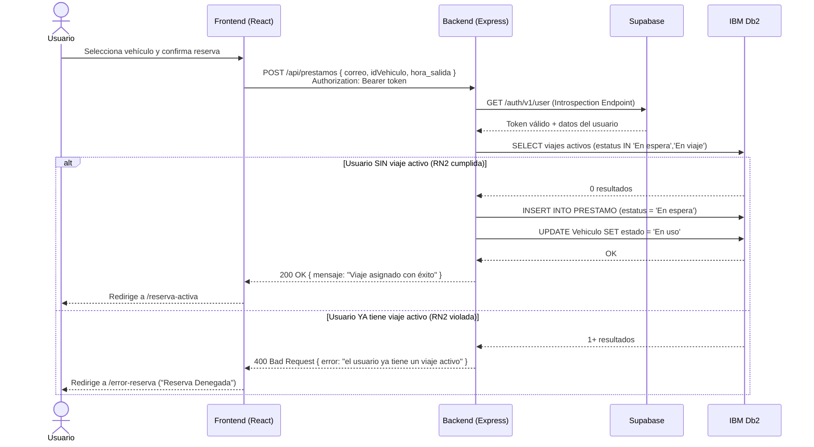

# UV Move — Prueba de Concepto (PoC)

Sistema de movilidad universitaria para la reserva de scooters y bicicletas dentro del campus. Este repositorio contiene la Prueba de Concepto (PoC) que valida la arquitectura propuesta: una SPA en React conectada a una API REST en Node.js, con autenticación delegada a Supabase y persistencia en IBM Db2.


---

## Tabla de contenidos

1. [Arquitectura](#arquitectura)
2. [Tecnologías y versiones](#tecnologías-y-versiones)
3. [Diagrama de base de datos](#diagrama-de-base-de-datos)
4. [Diagrama de secuencia — flujo de reserva](#diagrama-de-secuencia--flujo-de-reserva)
5. [Requisitos previos](#requisitos-previos)
6. [Variables de entorno](#variables-de-entorno)
7. [Instalación y ejecución](#instalación-y-ejecución)
8. [Estructura del proyecto](#estructura-del-proyecto)
9. [Endpoints de la API](#endpoints-de-la-api)
10. [Trazabilidad: requisitos y reglas de negocio](#trazabilidad-requisitos-y-reglas-de-negocio)
11. [Escenarios de prueba end-to-end](#escenarios-de-prueba-end-to-end)
12. [Hallazgos y lecciones aprendidas](#hallazgos-y-lecciones-aprendidas)
13. [Roadmap / pendientes conocidos](#roadmap--pendientes-conocidos)

---

## Arquitectura

El sistema está dividido en dos módulos independientes que se comunican por HTTP, más dos servicios externos (autenticación y base de datos).



- El **Frontend** nunca habla directamente con Db2: toda la persistencia pasa por la API.
- El **Backend** nunca valida contraseñas ni firma JWT: delega esa responsabilidad por completo a Supabase.
- Cada request protegido incluye `Authorization: Bearer <token>`, validado en el middleware `verificarToken` contra el Introspection Endpoint de Supabase.

---

## Tecnologías y versiones

| Capa | Tecnología | Versión | Rol |
|---|---|---|---|
| Frontend | [React](https://react.dev) | `^19.2.8` | Librería de UI |
| Frontend | [React DOM](https://react.dev) | `^19.2.8` | Renderizado en el navegador |
| Frontend | [React Router DOM](https://reactrouter.com) | `^7.18.4` | Enrutamiento de la SPA |
| Frontend | [Vite](https://vite.dev) | `^8.3.0` | Bundler y servidor de desarrollo |
| Frontend | [@vitejs/plugin-react](https://github.com/vitejs/vite-plugin-react) | `^6.1.1` | Soporte de React en Vite (vía Oxc) |
| Frontend | [oxlint](https://oxc.rs) | `^1.81.0` | Linter |
| Auth | [@supabase/supabase-js](https://supabase.com/docs/reference/javascript) | `^2.116.0` | Cliente de Supabase (frontend) |
| Backend | [Node.js](https://nodejs.org) | `≥ 18` | Runtime |
| Backend | [Express](https://expressjs.com) | `^5.2.1` | Framework de la API REST |
| Backend | [ibm_db](https://www.npmjs.com/package/ibm_db) | `^4.0.1` | Driver nativo de conexión a IBM Db2 |
| Backend | [cors](https://www.npmjs.com/package/cors) | `^2.8.6` | Middleware CORS |
| Backend | [dotenv](https://www.npmjs.com/package/dotenv) | `^17.4.2` | Carga de variables de entorno |
| Backend | [jsonwebtoken](https://www.npmjs.com/package/jsonwebtoken) | `^9.0.3` | Generación de tokens de prueba (script de desarrollo) |
| Backend (dev) | [nodemon](https://www.npmjs.com/package/nodemon) | `^3.1.14` | Recarga automática en desarrollo |
| Base de datos | [IBM Db2](https://www.ibm.com/products/db2) | — | Motor relacional, desplegado en contenedor Docker |
| Gestor de paquetes | [pnpm](https://pnpm.io) | — | Workspace del frontend y de la raíz del monorepo |

> El backend usa `npm`/`package-lock.json` de forma independiente; el frontend y la raíz del repositorio están organizados como un *workspace* de `pnpm` (`pnpm-workspace.yaml`).

---

## Diagrama de base de datos

Modelo relacional implementado en `database/schema.sql`. `Usuario` es la entidad base de la que heredan (por especialización) `Alumno` y `Maestro`; `Vehiculo` y `Prestamo` sostienen la lógica de reservas.



**Restricciones relevantes (`CHECK`):**
- `Vehiculo.estado` ∈ `{Libre, En uso, Fuera de servicio, Mantenimiento}`
- `Vehiculo.tipo` ∈ `{Bicicleta, Scooter}`
- `Prestamo.estatus` ∈ `{Pagado, En espera, En viaje}`
- `Alumno.carrera` ∈ `{ISW, LTIO, CON, GES}`
- `Usuario.correo` debe contener `@`

> ⚠️ **Nota sobre IBM Db2:** el driver `ibm_db` serializa y devuelve los nombres de columna en **MAYÚSCULAS** (`IDVEHICULO`, `ESTATUS`, etc.), sin importar cómo se escriban en el `CREATE TABLE`. El Frontend debe leer las respuestas de la API respetando ese formato.

---

## Diagrama de secuencia — flujo de reserva

Cubre el *happy path* (R6) y el rechazo por regla de negocio (RN2), tal como los ejecuta `POST /api/prestamos`.



---

## Requisitos previos

- **Node.js** ≥ 18 y **npm**
- **pnpm** (`npm install -g pnpm`) para el frontend y la raíz del workspace
- **Docker** (o Docker Desktop) para levantar IBM Db2
- Una cuenta/proyecto de **Supabase** con Auth habilitado

---

## Variables de entorno

Crea los siguientes archivos `.env` (no se versionan; agrégalos a `.gitignore` si aún no están).

### `api-uvmove/.env`

```env
PORT=3000

# Conexión a IBM Db2
DB_DATABASE=uvmove
DB_HOST=localhost
DB_PORT=50000
DB_USER=db2inst1
DB_PASSWORD=tu_password

# Solo necesario para el script de generación de tokens de prueba (src/generarToken.js)
SUPABASE_JWT_SECRET=tu_jwt_secret_de_supabase
```

### `frontend-uvmove/.env`

```env
VITE_SUPABASE_URL=https://tu-proyecto.supabase.co
VITE_SUPABASE_ANON_KEY=tu_anon_key_de_supabase
```

> **Pendiente conocido:** actualmente la URL y la `anon key` de Supabase también están escritas directamente en `api-uvmove/src/index.js` (middleware `verificarToken`). Se recomienda migrarlas a variables de entorno (`SUPABASE_URL`, `SUPABASE_ANON_KEY`) antes de cualquier despliegue fuera de la PoC.

---

## Instalación y ejecución

### 1. Base de datos (IBM Db2 en Docker)

```bash
docker run -itd --name uvmove-db2 --privileged=true \
  -p 50000:50000 \
  -e LICENSE=accept \
  -e DB2INST1_PASSWORD=tu_password \
  -e DBNAME=uvmove \
  ibmcom/db2

# Espera a que el contenedor termine de inicializar y luego ejecuta el schema:
docker exec -ti uvmove-db2 bash -c "su - db2inst1"
# Dentro del contenedor / o con un cliente Db2:
db2 -tf database/schema.sql
```

### 2. Backend (`api-uvmove`)

```bash
cd api-uvmove
npm install
npm run dev      # con nodemon (recarga automática)
# o bien:
node src/index.js
```

La API queda disponible en `http://localhost:3000`. Verifica que esté corriendo con:

```bash
curl http://localhost:3000/api/status
```

### 3. Frontend (`frontend-uvmove`)

```bash
cd frontend-uvmove
pnpm install
pnpm run dev
```

La SPA queda disponible en `http://localhost:5173`.

### 4. (Opcional) Generar un token de prueba

Para probar endpoints protegidos con Thunder Client / Postman sin pasar por el login de la UI:

```bash
cd api-uvmove
node src/generarToken.js
```

---

## Estructura del proyecto

```
UVMove-PoC/
├── api-uvmove/                 # Backend — API REST (Node.js + Express)
│   └── src/
│       ├── index.js            # Endpoints, middleware de auth, conexión a Db2
│       └── generarToken.js     # Utilidad de desarrollo: genera un JWT de prueba
│
├── frontend-uvmove/             # Frontend — SPA (React + Vite)
│   └── src/
│       ├── App.jsx              # Definición de rutas (React Router)
│       ├── supabaseClient.js    # Cliente de Supabase (auth)
│       └── vistas/
│           ├── Login.jsx
│           ├── Mapa.jsx             # Catálogo de vehículos disponibles
│           ├── DetalleVehiculo.jsx
│           ├── ReservaActiva.jsx    # Cuenta regresiva de la reserva
│           ├── ViajeEnCurso.jsx     # Taxímetro (localStorage + setInterval)
│           └── ErrorReserva.jsx     # Vista de "Reserva Denegada"
│
├── database/
│   └── schema.sql               # DDL + datos semilla para IBM Db2
│
├── pnpm-workspace.yaml
└── readme.md
```

### Mapa de rutas del Frontend

| Ruta | Vista | Protegida |
|---|---|---|
| `/` | `Login` | No |
| `/mapa` | `Mapa` (catálogo) | Sí |
| `/vehiculos` | `DetalleVehiculo` | Sí |
| `/reserva-activa` | `ReservaActiva` | Sí |
| `/viaje-en-curso` | `ViajeEnCurso` | Sí |
| `/error-reserva` | `ErrorReserva` | Sí |

---

## Endpoints de la API

Todos los endpoints protegidos requieren la cabecera `Authorization: Bearer <token>`, validada por el middleware `verificarToken` contra Supabase.

| Método | Ruta | Protegido | Descripción |
|---|---|---|---|
| `GET` | `/api/status` | No | Healthcheck del servicio |
| `GET` | `/api/Usuarios/:correo/viaje-activo` | No | Indica si el usuario tiene un viaje en curso |
| `GET` | `/api/vehiculos` | Sí | Lista el catálogo de vehículos y su estado |
| `POST` | `/api/prestamos` | Sí | Crea una reserva (R6/R7, valida RN2) |
| `POST` | `/api/prestamos/finalizar` | Sí | Cierra el viaje activo y libera el vehículo |
| `DELETE` | `/api/prestamos/cancelar` | Sí | Cancela una reserva activa y libera el vehículo |
| `POST` | `/api/usuarios/sync` | Sí | Sincroniza el usuario de Supabase con la tabla `Usuario` |

---

## Trazabilidad: requisitos y reglas de negocio

**Requisitos funcionales atendidos:**
- **R6.** El usuario puede reservar un vehículo disponible.
- **R7.** Una reservación impide temporalmente que el vehículo sea asignado a otro usuario.

**Reglas de negocio:**
- **RN2.** Un usuario no puede tener más de un vehículo en uso simultáneamente.
- **RN3.** Un vehículo solo puede reservarse si se encuentra "Libre".

**Módulo solicitante:** Reservaciones (gestiona la retención de una unidad a nombre de un estudiante).
**Interfaz / Servicio:** `POST /api/prestamos`

### Contrato del endpoint `POST /api/prestamos`

- **Entrada:** JSON con `correo`, `idVehiculo`, `hora_salida` + cabecera `Authorization: Bearer`.
- **Condición:** validación cruzada en Db2; el correo no debe existir en un préstamo con estatus `En espera` o `En viaje`.
- **Salida:** `200 OK` (éxito) o `400 Bad Request` (rechazo).
- **Módulo proveedor:** Disponibilidad de vehículos.
- **Entidades / tablas:** `Usuario` (identidad y FK), `Vehiculo` (catálogo y cambio de estado), `PRESTAMO` (registro transaccional).

---

## Escenarios de prueba end-to-end

- **Escenario exitoso (happy path):** un usuario sin viajes activos visualiza el catálogo filtrando por estatus `Libre`, solicita reservar la unidad; el backend valida, inserta el registro en `PRESTAMO` con estatus `En espera` y actualiza el `Vehiculo` a `En uso`. El frontend redirige a la vista de reserva activa / taxímetro.
- **Escenario de rechazo (RN2):** el usuario, teniendo una reserva activa, intenta forzar la solicitud de un segundo vehículo. El endpoint `POST /api/prestamos` lee Db2, detecta el viaje previo, evalúa la RN2, aborta la transacción (evitando el `INSERT` y el `UPDATE`) y devuelve `400`. La interfaz captura el error y muestra la vista "Reserva Denegada".
- **Resultado esperado:** se mantiene la integridad transaccional en IBM Db2. Es imposible que existan préstamos dobles para un mismo usuario, y el catálogo refleja en tiempo real cuando un vehículo deja de estar disponible.

---

## Hallazgos y lecciones aprendidas

Durante el desarrollo de la PoC, el diseño arquitectónico general fue validado con éxito; sin embargo, la integración estricta con IBM Db2 reveló inconsistencias transaccionales que obligaron a refactorizar la lógica del backend.

1. **Serialización de datos.** El modelo de datos original no contemplaba que los drivers de IBM Db2 exigen el mapeo estricto de columnas en **MAYÚSCULAS** al serializar el JSON (`IDVEHICULO`, `ESTADO`), lo que rompió el contrato inicial entre el Frontend y el Backend en la primera iteración.
2. **Integridad transaccional.** Fue necesario ajustar las consultas SQL del módulo de Disponibilidad (`UPDATE Vehiculo SET estado = 'En uso'`) para que los endpoints de Reservaciones no solo crearan el `PRESTAMO`, sino que efectivamente dispararan la actualización en el módulo de vehículos dentro de la misma operación.
3. **Seguridad.** Se blindó el entorno utilizando validación estricta de identidad mediante *Introspection Endpoints* de la API de Supabase, sustituyendo la verificación local de algoritmos JWT que generaba conflictos.

---

## Roadmap / pendientes conocidos

- [ ] Mover la URL y `anon key` de Supabase del backend (`api-uvmove/src/index.js`) a variables de entorno.
- [ ] Envolver `INSERT`/`UPDATE` de `POST /api/prestamos` en una transacción explícita (commit/rollback) en lugar de dos queries independientes.
- [ ] Agregar pruebas automatizadas (actualmente `npm test` no está implementado en ningún paquete).
- [ ] Reemplazar las URLs de `fetch` hardcodeadas (`http://localhost:3000`) en el frontend por una variable de entorno (`VITE_API_URL`).
- [ ] Documentar el flujo de despliegue de IBM Db2 en un entorno distinto a Docker local.
